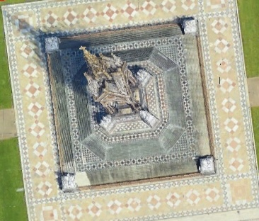
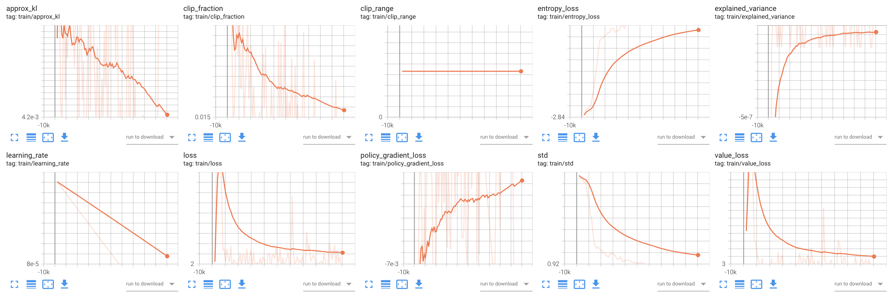
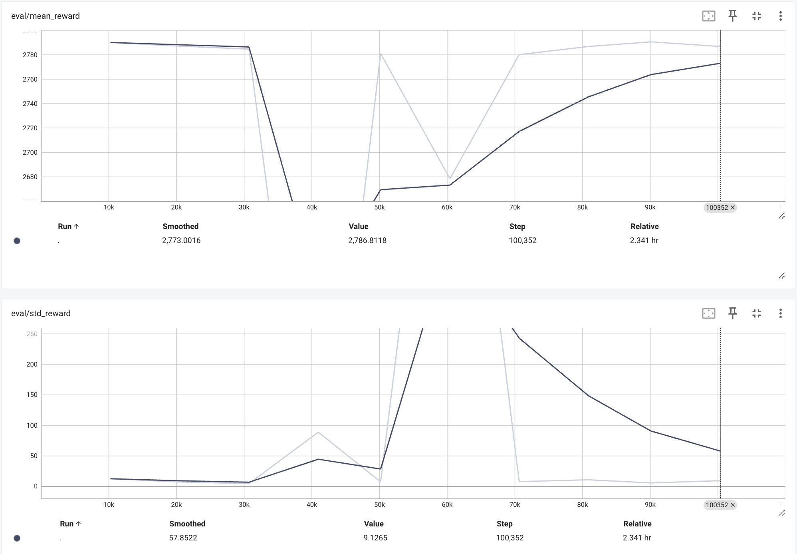
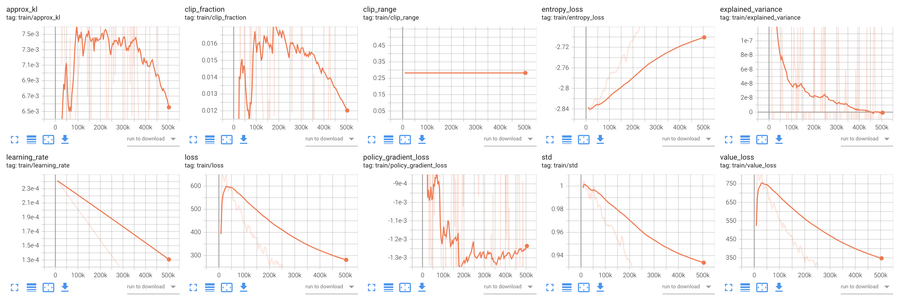
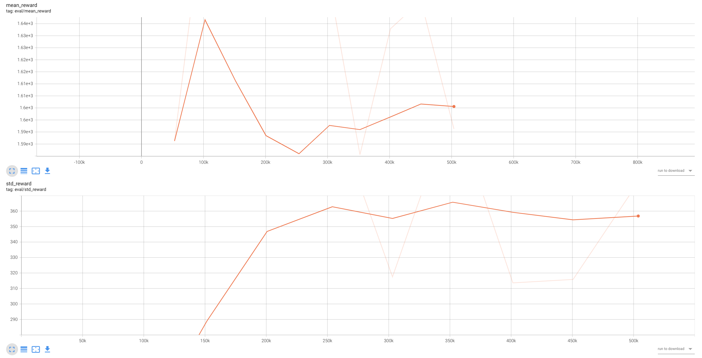

# 3d-map-rl-localization

## Introduction

This repository presents the research conducted as part of the Undergraduate Research Opportunities Programme (UROP) at Imperial College London. The project was carried out during a Research Internship at the [Deepwok Lab](https://deepwok.github.io/) led by [Dr. Aaron (Yiren) Zhao](https://profiles.imperial.ac.uk/a.zhao) in the Department of Electrical and Electronic Engineering.

#### *Project Title: '3D Map-based Deep Reinforcement Learning Localization'*

Supervised by: [Dr. Aaron (Yiren) Zhao](https://profiles.imperial.ac.uk/a.zhao) and [Dr. Ilia Shumailov](https://scholar.google.co.uk/citations?user=e-YbZyEAAAAJ&hl=en)\
Authored By: Anthony Bolton


## Overview
`3d-map-rl-localization` is a Deep Reinforcement Learning (DRL) model designed to navigate through large satellite images to locate specific target locations. The model works with high-resolution 3D bird's-eye view imagery from Google Earth Engine API, capturing depth and spatial relationships in the environment. It uses the Proximal Policy Optimization (PPO) algorithm and operates within a custom environment based on the Gymnasium framework. The system serves as a baseline for a novel approach to navigating and analyzing 3D aerial imagery using reinforcement learning techniques, aiming to estimate coordinates of event occurrences from image inputs shared across digital platforms.

 By leveraging 3D aerial imagery, the model can potentially be applied to various fields such as urban planning, emergency response, and geographical analysis. The use of reinforcement learning allows the system to adapt to different environments and improve its performance over time, making it a versatile tool for spatial analysis and location estimation tasks.

## Model Architecture Summary
### Envvironment (`SatelliteEnv`)
- Custom [Gymnasium](https://gymnasium.farama.org/index.html) (previously OpenAI Gym) environment simulating navigation in large 3D satellite ariel images
- **State Space**: dictionary with two 224x224x3 RGB images (target and current view)
- **Action Space**: continuous 2D movement, Box(2) with range [-1, 1], scaled by action_step (default 0.05)
- **Reward Function**: 
    - *Primary*: sosine similarity between current view and target image
    - *Scaling Bonus*: Increases as the agent approaches the target, providing a smoother reward signal (e.g. success threshold when testing the best baseline model was 0.95 cosine similarity, reward starts to scale once it reaches 0.90)
    - *Success Reward*: +100 when similarity exceeds threshold (default 0.90)
    - *Time Penalty*: -0.01 per step for efficiency
- **step(action)**: updates position, extracts new view, calculates reward
- **reset()**: randomizes agent position, selects new target
- **get_current_image(coordinate)**: extracts current view of agent, image at same scale as target image is cropped based on the agent's current position as the center from environment image, ensuring consistency in navigation size
- **Agent Movement**: new position calculated as (x + ax * action_step, y + ay * action_step), clipped to environment bounds
- **Episode Termination**: success (similarity > threshold) or max steps reached (default 1000)

### Image Encoder (`SatelliteFeatureExtractor`)
- Feature extractor inheriting from `BaseFeaturesExtractor`
- **Core**: [MobileNetV2](https://arxiv.org/abs/1801.04381) (pretrained on ImageNet, classifier removed)
    - Processes target and current state images independently
    - Output: 1280-dimensional feature vector per image
- Agent Observation (Feature Combination):
    - Concatenation of target and current state features (2560-dimensional vector)

```
-> Linear(2560, 128) followed by ReLU activation 
-> Linear(128, 64) 
-> Final output: 64-dimensional feature vector
```

### Policy(`SatelliteRLPolicy`)
- Custom `ActorCriticPolicy` using SatelliteFeatureExtractor as feature extractor
- **Actor (Policy) Network**:
    - Maps 64-dimensional state features to action probabilities
    - Output: Mean and standard deviation for Gaussian action distribution
- **Critic (Value) Network**:
    - Estimates state-value function
    - Maps 64-dimensional features to single value
- Implements PPO algorithm from [Stable Baselines3](https://stable-baselines3.readthedocs.io/en/master/modules/ppo.html) for stable training in continuous action space

### Training Process
1. [Optuna](https://optuna.org/) framework for hyperparameter optimization with custom `SimulatedAnnealingSampler`
2. Environment Setup:
    - Training, evaluation and testing manually cropped from environment image at `data`, with a 80/20 split
    - Applied Wrappers: TimeLimit and Monitor for episode management and logging
3. Model initialization: PPO with optimized hyperparameters
4. Training Loop:
    - `model.learn()` called with specified total timesteps
    - Callbacks:
        - `LoggerRewardCallback`: Detailed logging of rewards and episode info
        - `EvalCallback`: Evaluation on validation set every 10,000 steps
        - `TestCallback`: Testing on separate test set every 50,000 steps
5. PPO implementation with adaptive learning rate (`get_linear_fn`)
6. Final Evaluation:
    - Performed on train/eval set and test set with number of episodes


## Experiments and Results
#### Environment Image: `data/env/south_kensington.jpg`

### Experiment 0: Best performing baseline model trained on 1 image
This experiment serves as a baseline for our satellite image localization task, focusing on training and evaluating the agent's performance on a single, high-performing target image. `target_003_statue` is selected as the singular training target because it demonstrated the best performance among all available images in the dataset.

To further explore the agent's capabilities, the experiment scaled up the training size and removed optimization caps. Specifically, episodes were designed not to terminate - to observe how high the reward could go under extended training conditions on one image.

#### Train and Evaluate(1 Image): `data/train_eval/target_003_statue.jpg`
<div align="center">
  
</div>

#### Test(7 Images): `data/test`


<div style="display: flex; justify-content: space-between;">

  <div style="width: 45%;">
    <h4>Configuration</h4>
    <table>
      <tr>
        <th>Parameter</th>
        <th>Value</th>
      </tr>
      <tr>
        <td>Rollout Length (n_steps)</td>
        <td>1,024</td>
      </tr>
      <tr>
        <td>Optuna Trials</td>
        <td>2</td>
      </tr>
      <tr>
        <td>Optuna Timesteps per Trial</td>
        <td>50,000</td>
      </tr>
      <tr>
        <td>Training Timesteps</td>
        <td>100,000</td>
      </tr>
      <tr>
        <td>Eval Frequency</td>
        <td>10,000</td>
      </tr>
      <tr>
        <td>Eval Episode</td>
        <td>10</td>
      </tr>
      <tr>
        <td>Test Frequency</td>
        <td>50,000</td>
      </tr>
      <tr>
        <td>Test Episode</td>
        <td>25</td>
      </tr>
    </table>
  </div>

  <div style="width: 45%;">
    <h4>Results</h4>
    <table>
      <tr>
        <th>Metric</th>
        <th>Value</th>
      </tr>
      <tr>
        <td>Average Cosine Similarity</td>
        <td>0.9036</td>
      </tr>
      <tr>
        <td>Highest Cosine Similarity</td>
        <td>0.9154</td>
      </tr>
      <tr>
        <td>Highest Episode (2,500 steps) Reward</td>
        <td>3,738.2632</td>
      </tr>
      <tr>
        <td>Highest Step Reward</td>
        <td>2.4582</td>
      </tr>
    </table>
  </div>

</div>


**Model performance on train/eval set**: 2787.31 +/- 6.30

**Model performance on test set**: 2512.61 +/- 1067.12 
- 1/7 images navigated: `test_target_006_victoria_albert_museum_rooftop`, final sim: 0.9128

### Training


### [PPO Parameters]((https://stable-baselines3.readthedocs.io/en/master/modules/ppo.html#parameters)) From SB3 During Training



### Evaluation




## Experiment 1: Full pipeline(train, eval, test) trained on multiple images
This experiment trained the agent on 25 images and tested it on 7 unseen images. The training process involved exposing the agent to different target images across episodes. At the start of each episode, the environment reset with a randomly selected target image from the training set and a new starting coordinate for the agent. The agent learned to navigate and locate targets across this set of images, developing a generalized policy for the localization task. The experiences and learning from all 25 images were aggregated into the agent's overall policy throughout the training process. 

This approach aimed to create an agent capable of handling diverse target scenarios and generalizing to new, unseen targets. The performance was then evaluated on the set of 7 test images to assess the agent's ability to apply its learned policy to novel situations.
#### Train and Evaluate(25 Images): `data/train_eval`
#### Test(7 Images): `data/test`

<div style="display: flex; justify-content: space-between;">

  <div style="width: 45%;">
    <h4>Configuration</h4>
    <table>
      <tr>
        <th>Parameter</th>
        <th>Value</th>
      </tr>
      <tr>
        <td>Rollout Length (n_steps)</td>
        <td>4,096</td>
      </tr>
      <tr>
        <td>Optuna Trials</td>
        <td>5</td>
      </tr>
      <tr>
        <td>Optuna Timesteps per Trial</td>
        <td>50,000</td>
      </tr>
      <tr>
        <td>Training Timesteps</td>
        <td>500,000</td>
      </tr>
      <tr>
        <td>Eval Frequency</td>
        <td>50,000</td>
      </tr>
      <tr>
        <td>Eval Episode</td>
        <td>25</td>
      </tr>
      <tr>
        <td>Test Frequency</td>
        <td>100,000</td>
      </tr>
      <tr>
        <td>Test Episode</td>
        <td>14</td>
      </tr>
    </table>
  </div>

  <div style="width: 45%;">
    <h4>Results</h4>
    <table>
      <tr>
        <th>Metric</th>
        <th>Value</th>
      </tr>
      <tr>
        <td>Average Cosine Similarity</td>
        <td>0.8510</td>
      </tr>
      <tr>
        <td>Highest Cosine Similarity</td>
        <td>0.8904</td>
      </tr>
      <tr>
        <td>Highest Episode (1,500 steps) Reward</td>
        <td>1,765.7706</td>
      </tr>
      <tr>
        <td>Highest Step Reward</td>
        <td>0.8897</td>
      </tr>
    </table>
  </div>

</div>
Model performance on train/eval set: 1573.11 +/- 431.30

- 2/25 targets navigated: 
    - `target_003_statue`, final sim: 0.9026, steps taken: 8
    - `target_009_imperial_main_entrance`, final sim: 0.9013, steps taken: 413

Model performance on test set: 1373.41 +/- 665.07
- 1/7 targets navigated: `test_target_006_victoria_albert_museum_rooftop`, final sim: 0.9034, steps taken: 1

(note that this experiment was designed to terminate the current episode if reward exceeds the successthreshold 0.90)


### Training

<div style="text-align:center">
    
</div>

### [PPO Parameters]((https://stable-baselines3.readthedocs.io/en/master/modules/ppo.html#parameters)) From SB3 During Training



### Evaluation



## Instructions To Run The Pipline
1. Before starting, ensure you have [Python](https://www.python.org/downloads/) and [pip](https://pypi.org/project/pip/) installed on your system.
2. It is recommended to use a [virtual environment](https://packaging.python.org/en/latest/guides/installing-using-pip-and-virtual-environments/) for the Python packages to avoid conflicts with local dependancies
3. Ensure you have CUDA available for GPU training. This project relies on GPU acceleration for efficient model training. Without CUDA and a compatible GPU, training times will be significantly longer and may be impractical.

### Install required dependencies
```
pip install -r requirements.txt
```

### To verify CUDA availability, run the following command:
```
python -c "import torch; print('CUDA available:', torch.cuda.is_available())"
```

### Finally, run the full RL pipline :)
```
python main_rl_pipline.py
```


